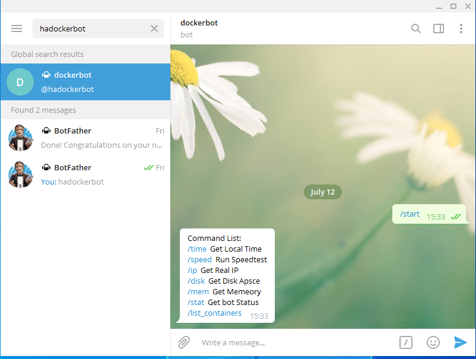
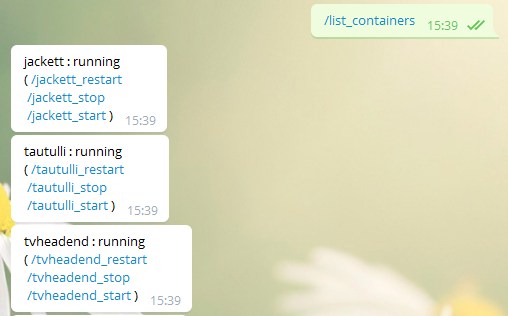
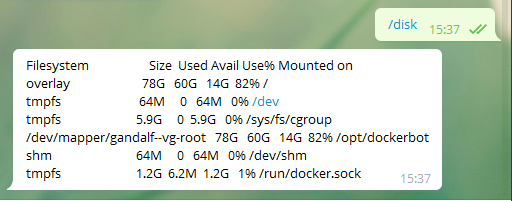
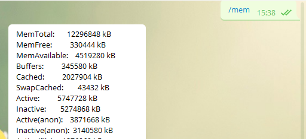
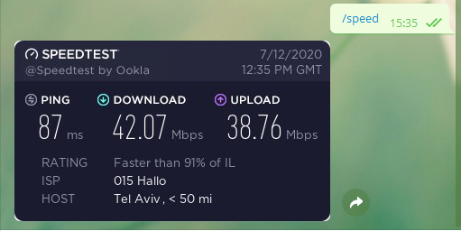
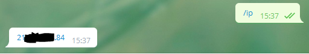
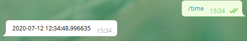
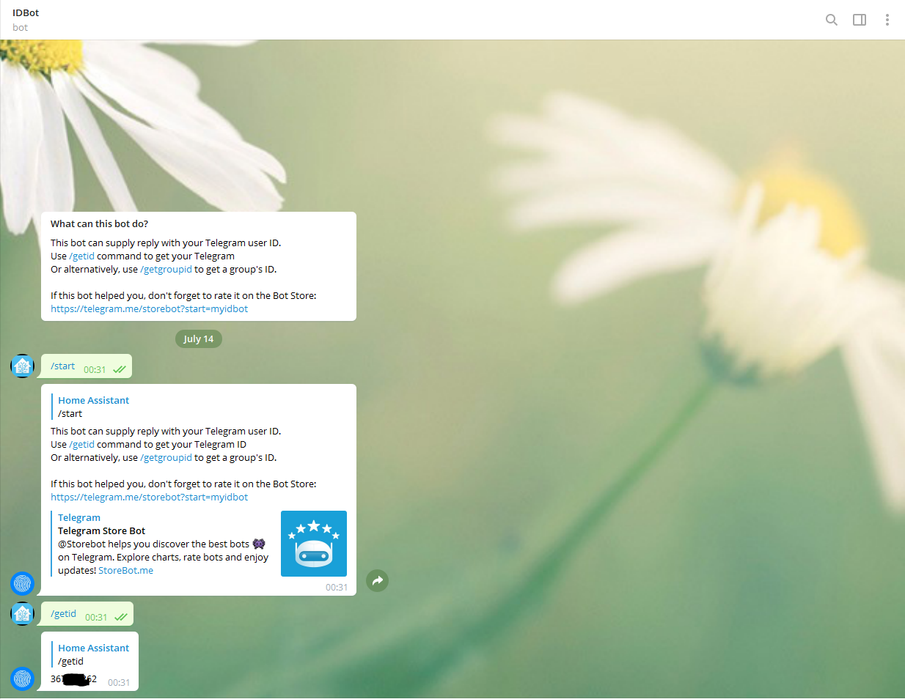

*Please :star: this repo if you find it useful*

<p align="left"><br>
<a href="https://www.paypal.com/paypalme/techblogil?locale.x=he_IL" target="_blank"></a>
</p>

# DockerBot

[](License)
[](https://hub.docker.com/r/techblog/dockerbot)

DockerBot is an easy-to-use Telegram bot, written in Python, that runs as a Docker container.
It lets you manage the Docker containers on your server (list, start, stop and restart them) and
check the state of the host (disk, memory, time, external IP and internet speed) straight from a
Telegram chat. Only the Telegram users you allow can use it.

The current source uses [python-telegram-bot](https://github.com/python-telegram-bot/python-telegram-bot)
(v13) and the [Docker SDK for Python](https://docker-py.readthedocs.io/). Older versions of the
code (including the image currently tagged `latest` on Docker Hub) were built on
[Telepot](https://telepot.readthedocs.io/en/latest/).

> **Known issue:** the current source does not start on Python 3.12 (the version used by the
> `Dockerfile`). See [Known issue: current source does not start](#known-issue-current-source-does-not-start).

## Table of Contents

- [Features](#features)
- [Screenshots](#screenshots)
- [How it works](#how-it-works)
- [Requirements](#requirements)
- [Installation](#installation)
- [Configuration](#configuration)
- [Usage](#usage)
- [Security notes](#security-notes)
- [Troubleshooting](#troubleshooting)
- [Development](#development)
- [Contributing](#contributing)
- [Credits](#credits)
- [License](#license)

## Features

With DockerBot you can:

- List existing containers (running and stopped) with their status.
- Start, stop and restart containers.
- Run a Speedtest and get the shareable result image.
- Get memory status (used, free, etc.).
- Get disk status.
- Get the server time.
- Get the server's real (external) IP.
- Check that the bot is alive.
- Restrict access to a list of allowed Telegram user IDs. Anyone else gets a "No Trespassing" image.

## Screenshots

### Command list (older, Telepot-based version)
[](screenshots/dockerbot_start.PNG)

### Containers list
[](screenshots/dockerbot_get_containers_list.PNG)

### Disk info
[](screenshots/dockerbot_get_disk_info.PNG)

### Memory info
[](screenshots/dockerbot_get_memory_info.PNG)

### Speedtest
[](screenshots/dockerbot_speedtest.PNG)

### Real IP
[](screenshots/dockerbot_get_real_ip.PNG)

### Server time
[](screenshots/dockerbot_get_time.PNG)

## How it works

- `dockerbot.py` connects to Telegram with long polling (no webhook and no open inbound port is
  needed) using the bot token from `API_KEY`.
- Every command first checks the sender's Telegram **user ID** against `ALLOWED_IDS`.
- Container commands talk to the Docker daemon through the Docker SDK (`docker.from_env()`),
  normally over the mounted `/var/run/docker.sock`.
- Host commands run small programs inside the container:
  `speedtest-cli --share`, `curl ipinfo.io/ip`, `df -h` and `cat /proc/meminfo`.

## Requirements

- Docker (and optionally Docker Compose) on the host you want to manage.
- A Telegram bot token. If you don't have a bot yet, create one with
  [@BotFather](https://t.me/BotFather); see
  [Bots: An introduction for developers](https://core.telegram.org/bots).
- Your Telegram user ID (see [Configuration](#configuration)).
- Outbound internet access (Telegram API, `ipinfo.io` and the Speedtest servers).

## Installation

### Docker image

The image is published on Docker Hub as
[`techblog/dockerbot`](https://hub.docker.com/r/techblog/dockerbot) (`linux/amd64`,
`linux/arm64`, `linux/arm/v7`).

> **Note:** the `latest` tag on Docker Hub was built on 2021-07-21 by an older workflow, from the
> older Telepot-based code. Its commands and access rules differ from the current source:
>
> - It has `/start` and `/?` (no `/help`), and its `/start` command list works.
> - It checks the **chat ID**, not the user ID, and it does a **substring** match against the
>   `ALLOWED_IDS` string. For example, `12345` is accepted when `123456789` is allowed. In a group,
>   the group's chat ID is checked.
> - If `ALLOWED_IDS` is not set, every message fails with an error instead of being rejected.
>
> Unless noted otherwise, the rest of this README describes the **current source**.

### Docker Compose

```yaml
services:
  dockerbot:
    image: techblog/dockerbot
    container_name: dockerbot
    restart: always
    environment:
      - API_KEY=        # Required: your bot token
      - ALLOWED_IDS=    # Required: comma-separated Telegram user IDs
    volumes:
      - /var/run/docker.sock:/var/run/docker.sock
```

The repository's [`docker-compose.yml`](docker-compose.yml) also sets `network_mode: host`,
`cap_add: NET_ADMIN` and `privileged: true`. The bot's code does not need any of these; the Docker
socket mount is the only requirement. Leave them out unless you have a reason to keep them (see
[Security notes](#security-notes)).

```bash
docker compose up -d
```

### Docker run

```bash
docker run -d \
  --name dockerbot \
  --restart always \
  -e API_KEY="<your bot token>" \
  -e ALLOWED_IDS="<your user id>" \
  -v /var/run/docker.sock:/var/run/docker.sock \
  techblog/dockerbot
```

### Known issue: current source does not start

The current source cannot run as it stands, so building the image from source is not a working
install method at the moment:

- `python-telegram-bot` 13.15 fails to import on Python 3.12 (its vendored `urllib3` breaks, and
  its fallback needs `urllib3<2`, while `requirements.txt` requires `urllib3>=2.2.2`).
- Its `APScheduler` dependency needs `pkg_resources`, which recent `setuptools` no longer provides.

The `Dockerfile` uses `python:3.12-slim`, so an image built from the current source is affected
too. Until this is fixed, the published Docker Hub image is the only runnable version.

## Configuration

DockerBot is configured only with environment variables:

| Variable | Required | Default | Description |
|---|---|---|---|
| `API_KEY` | Yes | *(empty)* | Telegram bot token. In the current source, the bot exits at startup with `API_KEY environment variable is not set` if it is missing. |
| `ALLOWED_IDS` | Yes | *(empty)* | Comma-separated list of allowed IDs, e.g. `123456789,987654321`. In the current source these are Telegram **user** IDs, matched exactly, spaces around IDs are ignored, and an empty value means nobody can use the bot. The published image checks **chat** IDs by substring (see [Docker image](#docker-image)). |

The Docker SDK also honours the standard Docker client variables (`DOCKER_HOST`,
`DOCKER_TLS_VERIFY`, `DOCKER_CERT_PATH`), so you can point the bot at a remote daemon instead of
mounting the socket.

### Getting your user ID

To get your ID, open [@myidbot](https://t.me/myidbot) in Telegram and send the `/getid` command.
The result is your ID:

[](screenshots/Idbot.PNG)

## Usage

Open a chat with your bot and send one of these commands:

| Command | Description |
|---|---|
| `/start`, `/help` | Show the command list. |
| `/list_containers` | List all containers (running and stopped) with their status, each followed by its start/stop/restart commands. |
| `/<container>_start` | Start a container. |
| `/<container>_stop` | Stop a container. |
| `/<container>_restart` | Restart a container. |
| `/time` | Get the server's local time. |
| `/speed` | Run a Speedtest (`speedtest-cli --share`) and send the result image. This takes a while. |
| `/ip` | Get the server's external IP (from `ipinfo.io`). |
| `/disk` | Get disk usage (`df -h`). |
| `/mem` | Get memory info (`/proc/meminfo`). |
| `/stat` | Check that the bot is alive (replies "Number five is alive!"). |

For container commands, `<container>` is the exact container name, e.g. `/nginx_restart`. After
the action the bot waits two seconds and reports the container's new status. You can tap the
commands in the `/list_containers` output instead of typing them.

`/disk` and `/mem` run inside the DockerBot container: `/mem` shows the host's memory, while
`/disk` shows the file systems visible to the container.

## Security notes

These notes describe the current source unless stated otherwise.

- **Mounting `/var/run/docker.sock` gives the bot root-equivalent access to the host.** Anyone who
  can control the bot can start, stop and restart any container. Keep your bot token secret and
  keep `ALLOWED_IDS` short.
- Access is checked against the sender's Telegram **user ID** (exact match). If you add the bot to
  a group, allowed users can run commands there and every group member sees the replies.
- The published Docker Hub image instead does a **substring** match of the **chat ID** against
  `ALLOWED_IDS`, so an unlisted ID that is part of an allowed ID is accepted. Use long, full IDs
  and don't add that image to groups.
- `privileged: true`, `NET_ADMIN` and host networking from the sample `docker-compose.yml` are not
  used by the bot. Removing them reduces the container's privileges.
- Unauthorized attempts are logged with the sender's user ID
  (`Unauthorized access attempt from user ID: ...`).

## Troubleshooting

The messages below come from the current source; the published image's messages differ.

- **The bot exits right away:** check the container logs (`docker logs dockerbot`). The message
  `API_KEY environment variable is not set` means the token is missing.
- **The bot replies with a "No Trespassing" image:** your user ID is not in `ALLOWED_IDS`. Check
  the logs for the ID that was rejected and add it.
- **`/start` or `/help` shows an empty command list:** the current source builds this list by
  scanning its own code, and that scan currently finds no commands. Use the table in
  [Usage](#usage) instead. <!-- TODO: verify once the command-list parser is fixed -->
- **`/list_containers` fails with `Error listing containers: ...`, or a start/stop/restart
  command fails with `Error starting container: ...` (or `stoping`/`restarting`):** the Docker
  socket is not mounted or not reachable. Mount `/var/run/docker.sock` as shown above.
- **`Container '<name>' not found`:** the name must match the container name exactly. Names with
  a dot (`.`) cannot be used as commands. Telegram does not make names with a hyphen (`-`) tappable,
  but you can still type them.
- **`/disk` replies `Error getting disk space: ...`:** a very long `df -h` output (for example on
  a host with many mounts) can exceed Telegram's message size limit.
- **"An error occurred while processing your request.":** an unhandled error; the details are in
  the container logs.

## Development

Project layout:

```
dockerbot.py          # the bot
requirements.txt      # Python dependencies
Dockerfile            # python:3.12-slim image (adds curl)
docker-compose.yml    # sample Compose file
scripts/next-version.sh  # computes the next YYYY.M.PATCH version
.github/workflows/    # manual Docker Hub and GHCR publishing workflows
```

Running the current source locally or building its image does not work at the moment; see
[Known issue: current source does not start](#known-issue-current-source-does-not-start).

To add a command, write a handler and register it with `dp.add_handler(CommandHandler(...))` in
`main()`. The `#[ description ]#` marker comment on a handler's `def` line is meant to add it to
the `/start` list, but it currently has no effect (see the empty command list under
[Troubleshooting](#troubleshooting)).

The repository has two manually triggered GitHub Actions workflows for `linux/amd64`,
`linux/arm64` and `linux/arm/v7`: `Docker Build` pushes `<DOCKERHUB_USERNAME>/dockerbot` (the
image name comes from a repository secret), and `Publish to GHCR` pushes `ghcr.io/t0mer/dockerbot`.
Neither has published anything yet: there are no version tags, Docker Hub has no image newer than
2021, and no GHCR image is publicly visible. The current Docker Hub `latest` was pushed by an older
workflow.

## Contributing

Issues and pull requests are welcome. Please keep changes focused and describe how you tested them.

## Credits

- [Adam Russak](https://github.com/AdamRussak) for working with me on this project.

## License

This project is licensed under the [Apache License 2.0](License).
